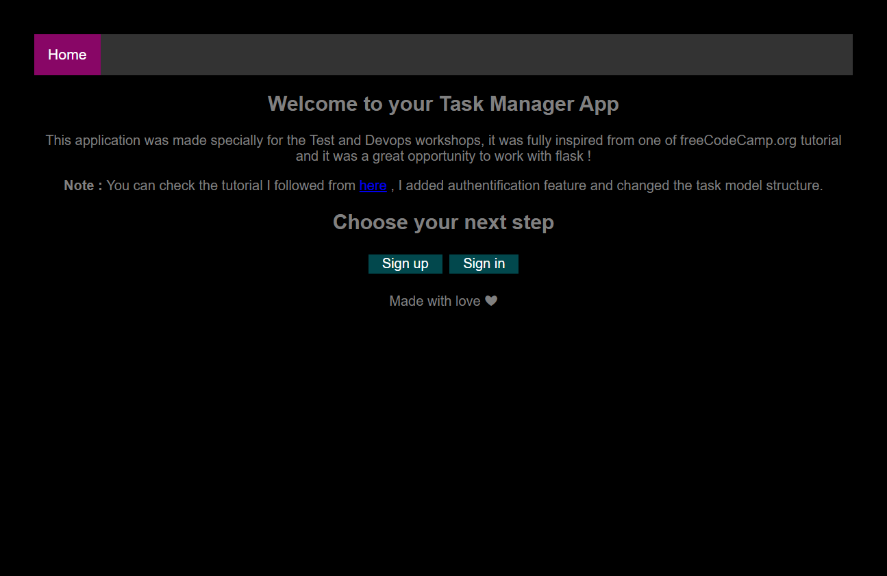
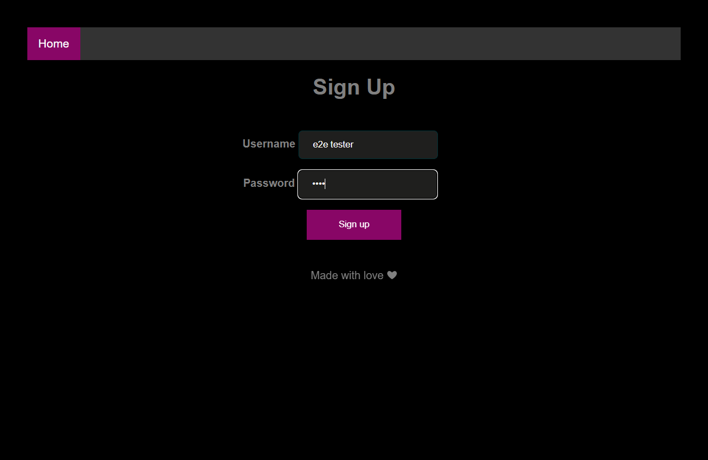
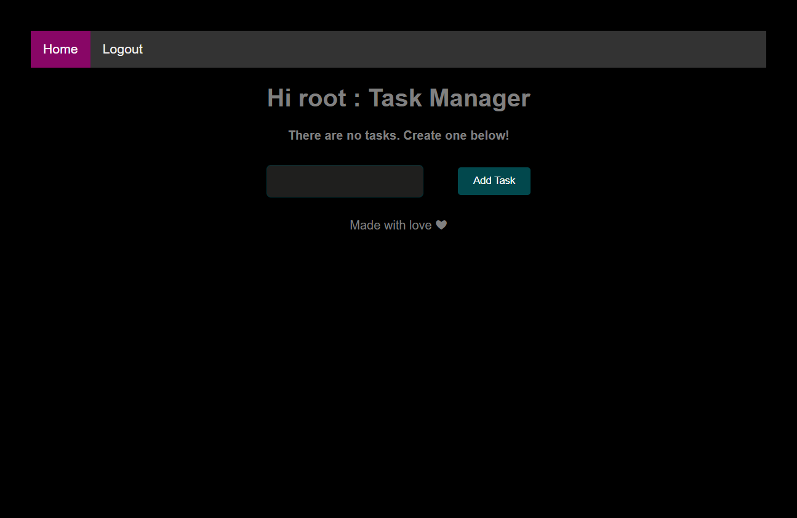
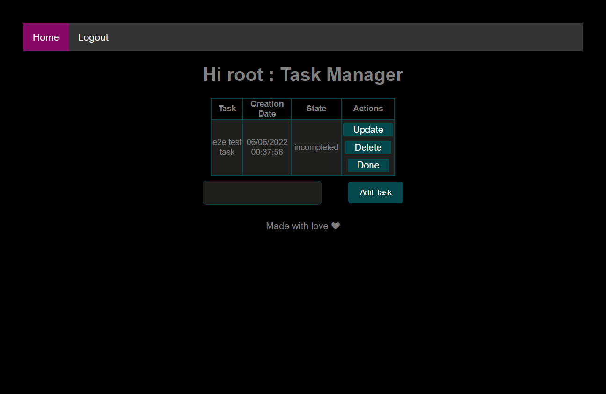

# Task-manager

## Introduction
This application was made specially for the Test and Devops workshops, it was fully inspired from one of freeCodeCamp.org
tutorial and it was a great opportunity to work with flask.

## Project
A simple task manager app created with flask and SQLite : 
  -It contains 2 models : User and Task
user can sign up , sign in and have his own space to manage his to do lists

## Tests
in each folder you'll find more details about tests treated :
  1. [Unit tests](./Tests/Unit/)
  2. [Integration tests](./Tests/integration/)
  3. [End 2 End](./e2e/) 
  4. [UAT](./UAT/)

